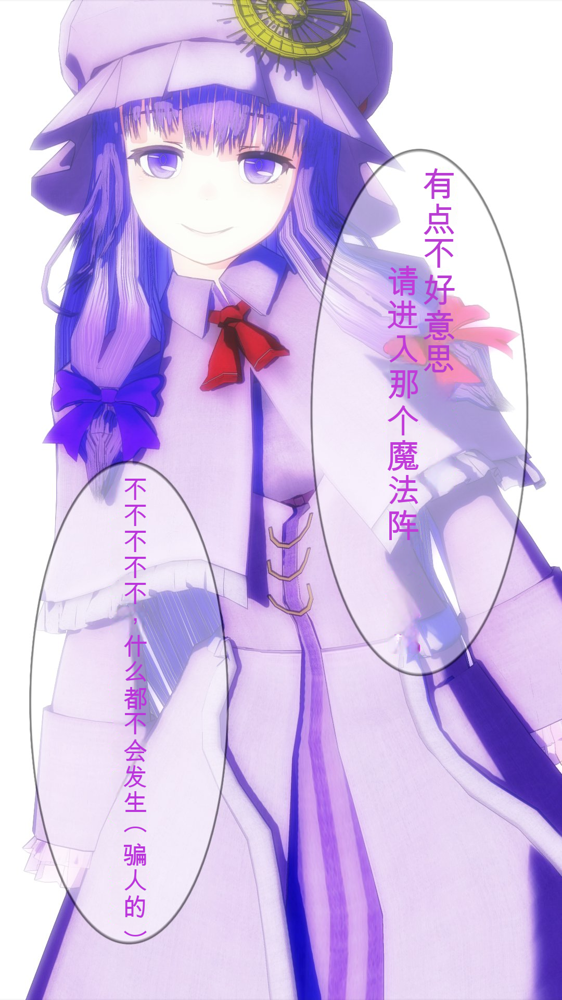
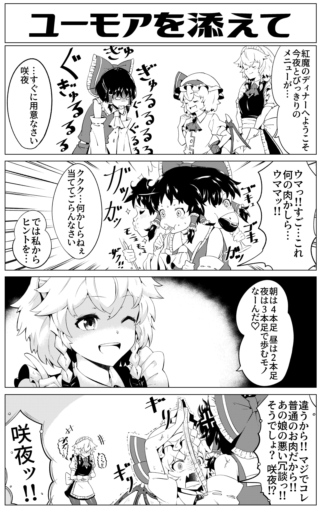
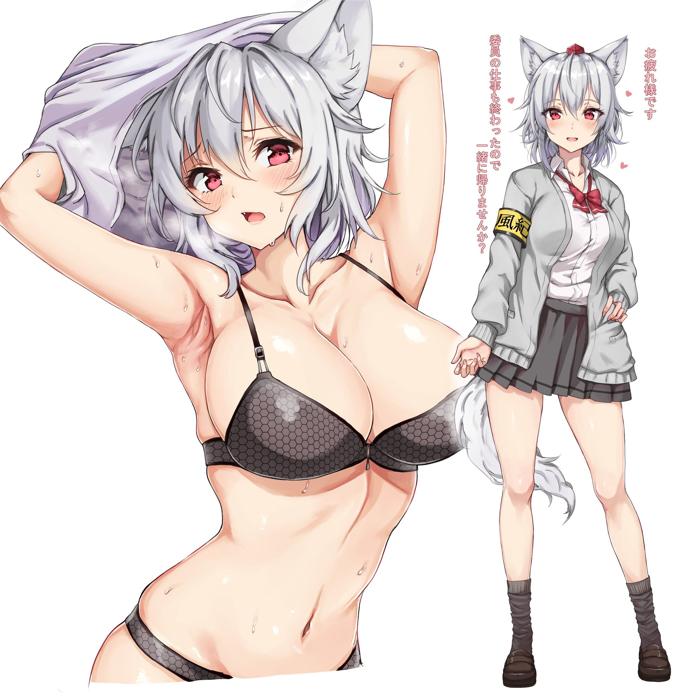

# 漫画图片翻译器 (中文说明)

> 一键翻译各类图片内文字\
> [English](README.md) | [更新日志](CHANGELOG_CN.md)

针对群内、各个图站上大量不太可能会有人去翻译的图片设计，让我这种日语小白能够勉强看懂图片\
主要支持日语，不过也能识别汉语和英文\
支持图片修补和嵌字\
该项目是[求闻转译志](https://github.com/PatchyVideo/MMDOCR-HighPerformance)的 v2 版本

**只是初步版本，我们需要您的帮助完善**\
这个项目目前只完成了简单的 demo，依旧存在大量不完善的地方，我们需要您的帮助完善这个项目！

## 支持我们

请支持我们使用 GPU 服务器，谢谢！

- Ko-fi: <https://ko-fi.com/voilelabs>
- Patreon: <https://www.patreon.com/voilelabs>
- 爱发电: <https://afdian.net/@voilelabs>

## 在线版

官方演示站 (由 zyddnys 维护)： <https://touhou.ai/imgtrans/>\
镜像站 (由 Eidenz 维护): <https://manga.eidenz.com/>\
浏览器脚本 (由 QiroNT 维护): <https://greasyfork.org/scripts/437569>

- 注意如果在线版无法访问说明 Google GCP 又在重启我的服务器，此时请等待我重新开启服务。
- 在线版使用的是目前 main 分支最新版本。

## 使用说明

```bash
# 首先，确信你的机器安装了 Python 3.8 及以上版本
$ python --version
Python 3.8.13

# 拉取仓库
$ git clone https://github.com/zyddnys/manga-image-translator.git

# 安装依赖
$ pip install -r requirements.txt
```

之后从 <https://github.com/zyddnys/manga-image-translator/releases/> 下载 `ocr.ckpt`、`detect.ckpt`、`comictextdetector.pt`、`comictextdetector.pt` 和 `inpainting.ckpt`，放到仓库的根目录下。

[使用谷歌翻译时可选]\
申请有道翻译或者 DeepL 的 API，把你的 `APP_KEY` 和 `APP_SECRET` 或 `AUTH_KEY` 写入 `translators/key.py` 中。

### 语言代码列表

可以填入 `--target-lang` 参数

```yaml
CHS: Chinese (Simplified)
CHT: Chinese (Traditional)
CSY: Czech
NLD: Dutch
ENG: English
FRA: French
DEU: German
HUN: Hungarian
ITA: Italian
JPN: Japanese
KOR: Korean
PLK: Polish
PTB: Portuguese (Brazil)
ROM: Romanian
RUS: Russian
ESP: Spanish
TRK: Turkish
VIN: Vietnames
```

### 使用命令行执行

```bash
# 如果机器有支持 CUDA 的 NVIDIA GPU，可以添加 `--use-cuda` 参数
# 使用 `--use-inpainting` 开启图片修补
# 使用 `--translator=<翻译器名称>` 来指定翻译器
# 使用 `--target-lang=<语言代码>` 来指定目标语言
# 将 <图片文件路径> 替换为图片的路径
$ python translate_demo.py --verbose --use-inpainting --use-cuda --translator=google --target-lang=CHS --image <path_to_image_file>
# 结果会存放到 result 文件夹里
```

#### 使用命令行批量翻译

```bash
# 其它参数如上
# 使用 `--mode batch` 开启批量翻译模式
# 将 <图片文件夹路径> 替换为图片文件夹的路径
$ python translate_demo.py --verbose --mode batch --use-inpainting --use-cuda --translator=google --target-lang=CHS --image <图片文件夹路径>
# 结果会存放到 `<图片文件夹路径>-translated` 文件夹里
```

### 使用浏览器 (Web 服务器)

```bash
# 其它参数如上
# 使用 `--mode web` 开启 Web 服务器模式
$ python translate_demo.py --verbose --mode web --use-inpainting --use-cuda
# 程序服务会开启在 http://127.0.0.1:5003
```

程序提供两个请求模式：同步模式和异步模式。\
同步模式下你的 HTTP POST 请求会一直等待直到翻译完成。\
异步模式下你的 HTTP POST 会立刻返回一个 `task_id`，你可以使用这个 `task_id` 去定期轮询得到翻译的状态。

#### 同步模式

1. POST 提交一个带图片，名字是 file 的 form 到 <http://127.0.0.1:5003/run>
2. 等待返回
3. 从得到的 `task_id` 去 result 文件夹里取结果，例如通过 Nginx 暴露 result 下的内容

#### 异步模式

1. POST 提交一个带图片，名字是 file 的 form 到<http://127.0.0.1:5003/submit>
2. 你会得到一个 `task_id`
3. 通过这个 `task_id` 你可以定期发送 POST 轮询请求 JSON `{"taskid": <task_id>}` 到 <http://127.0.0.1:5003/task-state>
4. 当返回的状态是 `finished`、`error` 或 `error-lang` 时代表翻译完成
5. 去 result 文件夹里取结果，例如通过 Nginx 暴露 result 下的内容

#### 人工翻译

人工翻译允许代替机翻手动填入翻译后文本

POST 提交一个带图片，名字是 file 的 form 到 <http://127.0.0.1:5003/manual-translate>，并等待返回

你会得到一个 JSON 数组，例如：

```json
{
  "task_id": "12c779c9431f954971cae720eb104499",
  "status": "pending",
  "trans_result": [
    {
      "s": "☆上司来ちゃった……",
      "t": ""
    }
  ]
}
```

将翻译后内容填入 t 字符串：

```json
{
  "task_id": "12c779c9431f954971cae720eb104499",
  "status": "pending",
  "trans_result": [
    {
      "s": "☆上司来ちゃった……",
      "t": "☆上司来了..."
    }
  ]
}
```

将该 JSON 发送到 <http://127.0.0.1:5003/post-translation-result>，并等待返回\
之后就可以从得到的 `task_id` 去 result 文件夹里取结果，例如通过 Nginx 暴露 result 下的内容

## 下一步

列一下以后完善这个项目需要做的事，欢迎贡献！

1. ~~图片涂改目前只是简单的涂白，图片修补的模型正在训练中！~~\
   图片修补基于[Aggregated Contextual Transformations for High-Resolution Image Inpainting](https://arxiv.org/abs/2104.01431)
2. ~~【重要，请求帮助】目前的文字渲染引擎只能勉强看，和 Adobe 的渲染引擎差距明显，我们需要您的帮助完善文本渲染！~~
3. ~~我尝试了在 OCR 模型里提取文字颜色，均以失败告终，现在只能用 DPGMM 凑活提取文字颜色，但是效果欠佳，我会尽量完善文字颜色提取，如果您有好的建议请尽管提 issue~~
4. ~~文本检测目前不能很好处理英语和韩语，等图片修补模型训练好了我就会训练新版的文字检测模型。~~ 韩语支持在做了
5. 文本渲染区域是根据检测到的文本，而不是汽包决定的，这样可以处理没有汽包的图片但是不能很好进行英语嵌字，目前没有想到好的解决方案。
6. [Ryota et al.](https://arxiv.org/abs/2012.14271) 提出了获取配对漫画作为训练数据，训练可以结合图片内容进行翻译的模型，未来可以考虑把大量图片 VQVAE 化，输入 nmt 的 encoder 辅助翻译，而不是分框提取 tag 辅助翻译，这样可以处理范围更广的图片。这需要我们也获取大量配对翻译漫画/图片数据，以及训练 VQVAE 模型。
7. 求闻转译志针对视频设计，未来这个项目要能优化到可以处理视频，提取文本颜色用于生成 ass 字幕，进一步辅助东方视频字幕组工作。甚至可以涂改视频内容，去掉视频内字幕。
8. ~~结合传统算法的 mask 生成优化，目前在测试 CRF 相关算法。~~
9. ~~尚不支持倾斜文本区域合并~~

## 效果图

以下图片为最初版效果，并不代表目前最新版本的效果。

|                                          原始图片                                           |         翻译后图片          |
| :-----------------------------------------------------------------------------------------: | :-------------------------: |
|                 |  |
|  |  |
|  |  |
|                      |  |
